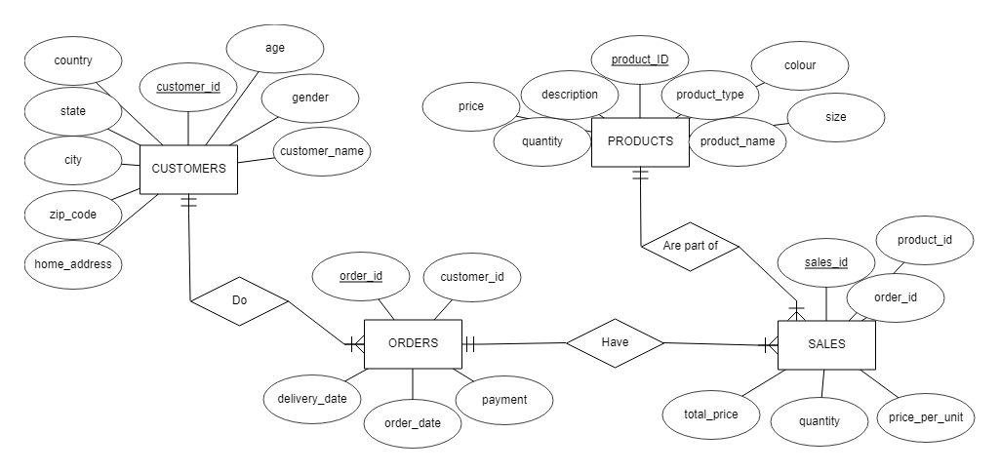
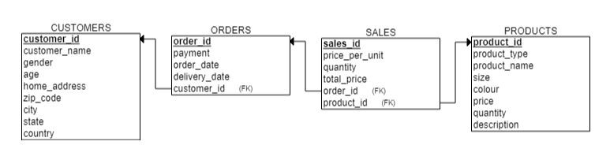
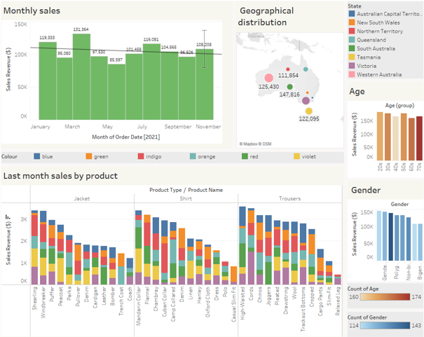

# E-commerce Sales Analysis
Noemi Carolina Guerra Montiel 
October 2023

## Summary
This project aims to use SQL and Tableau to analyze a synthetic database for e-commerce shopping. 
 
[Original Database in Kaggle](https://www.kaggle.com/datasets/ruchi798/shopping-cart-database/data?select=sales.csv)

## Entity Relationship (ER) Diagram

## Relational Schema

## Research Questions
- Which products were sold the most in the last month?
- How have sales and revenue changed over the past few quarters?
- Understanding Customer demographics and their preferences

## Tableau dashboard

