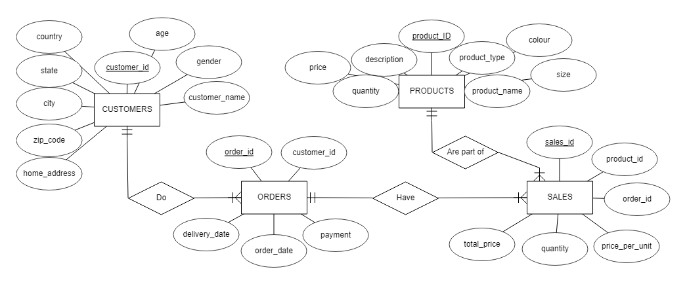

# E-commerce Sales Analysis
Noemi Carolina Guerra Montiel 
October 2023

## Summary
This project aims to use SQL and Tableau to analyze a synthetic dataset for e-commerce shopping. 

[Database](https://www.kaggle.com/datasets/ruchi798/shopping-cart-database/data?select=sales.csv)

## Entity-Relation (ER) Diagram

## Relation Schema
<!---->

## Contents
- SQL Code in MySQL / Microsoft SQL Server
- Tableau Dashboard
